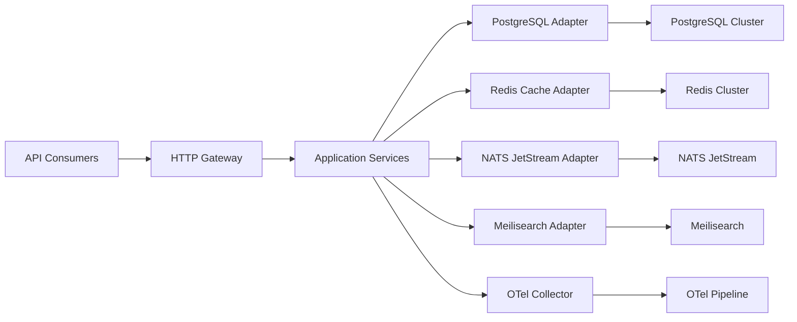

# Architecture Overview

This document defines the target architecture for the modern Go Fiber backend template, establishing module boundaries, runtime topology, and integration patterns.

## System Topology

## Layered Architecture

- **cmd/**: thin entrypoints for REST (Fiber) and gRPC gateways, wiring DI containers and lifecycle hooks.
- **internal/core/**: domain aggregates, value objects, domain services, and business rules with zero infrastructure knowledge.
- **internal/app/**: application service layer orchestrating use cases, transaction boundaries, and saga coordination.
- **internal/ports/**: inbound adapters exposing HTTP handlers, gRPC services, scheduled jobs, and message consumers.
- **internal/adapters/**: outbound integrations for persistence, cache, messaging, search, payments, email, and observability sinks.
- **pkg/shared/**: reusable utilities (validation, error codecs, telemetry helpers) designed for import stability.
- **configs/**: environment-specific configuration bundles and schema definitions consumed by Viper and env vars.

## Domain Modules

| Module | Responsibility | Key Entities |
| --- | --- | --- |
| auth | Identity lifecycle, credential storage, session tokens, MFA enrollment | User, Credential, Session, AuditTrail |
| forum | Threads, posts, comments, reactions, moderation workflows | Thread, Post, Comment, Reaction, ModerationQueue |
| notifications | Template-driven email, push, and websocket fan-out | NotificationTemplate, DeliveryAttempt |
| admin | RBAC policy management, tenant provisioning, feature flags | Role, Permission, TenantProfile |
| analytics | Event capture, aggregation, and trend queries over OLAP store | EventRecord, MetricSlice |

## Data Persistence and Messaging

- **Primary store**: PostgreSQL 16 with sqlc-generated repositories, leveraging UUID v7 keys and temporal tables for auditing.
- **Caching**: Redis Cluster (Valkey compatible) used for session tokens, rate limiting buckets, and projection caches.
- **Messaging**: NATS JetStream provides event streaming, command bus patterns, and at-least-once delivery semantics.
- **Search index**: Meilisearch for low-latency thread and post discovery with incremental sync workers.
- **Long-term analytics**: Optional ClickHouse pipeline fed via change data capture for dashboards.

## API Surface

- RESTful HTTP API served via Fiber 3 with JSend + problem+json codecs.
- gRPC gateway exposing high-throughput endpoints for internal services and SDK generation.
- Async APIs exposed through WebSocket channels and server-sent events for live thread updates.
- OpenAPI and Buf schema registries versioned per release channel.

## Observability and Reliability

- Distributed tracing via OpenTelemetry SDK exporting to collector, with Grafana Tempo as backend.
- Metrics emitted in Prometheus format, scraped by Prometheus Operator, visualized in Grafana dashboards.
- Structured logging through Zerolog enriched with request IDs, trace IDs, and user claims.
- Circuit breakers and bulkheads implemented with resilience middleware around outbound adapters.
- Chaos testing hooks integrated into staging via Litmus to validate failure scenarios.

## Security and Compliance

- JWT access tokens signed with PASETO-compatible keys, refresh tokens stored in Redis with rotation policies.
- Attribute-based access control (ABAC) layered over RBAC for fine-grained permissions.
- Audit logging persisted to immutable append-only tables with retention policies.
- Secrets management delegated to HashiCorp Vault with dynamic database credentials.
- Compliance hooks for GDPR erasure requests and data residency enforced through policy engine.

## Deployment Topologies

- **Local**: Tilt orchestrates Docker Compose services (API, PostgreSQL, Redis, NATS, Meilisearch, OTel collector) with hot reload via Air.
- **Staging**: Kubernetes cluster managed by Helmfile, leveraging KEDA for event-driven scaling and Argo Rollouts for canary deployments.
- **Production**: Multi-region GKE/AKS deployment with Cloud SQL or Aurora Postgres, Redis Enterprise, and managed NATS, fronted by API Gateway + Cloud Armor.

## Extension Points

- Code generation pipelines for mocks (`mockery`), protobuf (`buf`), and GraphQL (optional) triggered via `task generate`.
- Plugin system for domain modules by registering port interfaces within the DI container.
- Feature flag hooks via LaunchDarkly or open-source alternatives exposed through adapter layer.