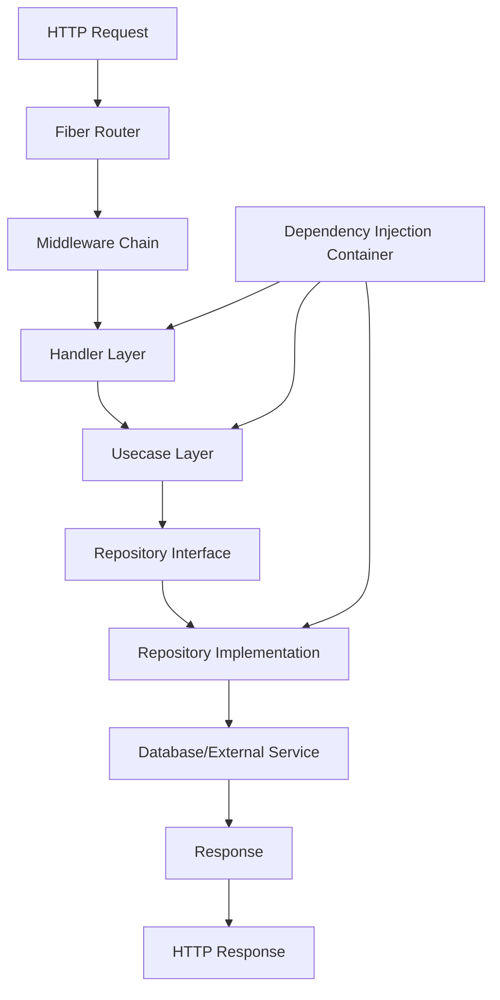

# **System Architecture: Go Fiber Skeleton**

## **1. High-Level Architecture Overview**

This project implements **Domain-Driven Clean Architecture** with a **mono-repo structure** using Go and the Fiber v2 framework. The architecture emphasizes strict domain isolation, SOLID principles, and dependency injection for maintainable, scalable backend services.

### **Core Architectural Principles**

* **Clean Architecture Layers:** Strict separation between domain logic, application services, and infrastructure
* **Domain-Driven Design:** Business logic encapsulated in distinct domains with clear boundaries
* **Dependency Injection:** Type-safe dependency management using Samber's do framework
* **Mono-repo Structure:** All code organized in a single repository with clear directory hierarchy
* **Test-Driven Development:** Comprehensive testing with mocks and isolation

## **2. Directory Structure and Organization**

```
gofiber-skeleton/
├── cmd/                          # Application entry points
│   └── server/                   # Main server application
│       └── main.go              # Server bootstrap and configuration
├── internal/                     # Private application code
│   ├── domains/                 # Business domains (DDD)
│   │   └── user/                # User domain (reference implementation)
│   │       ├── entity/          # Domain entities and models
│   │       ├── repository/      # Repository interfaces
│   │       ├── usecase/         # Business logic and use cases
│   │       └── handler/         # HTTP handlers/presenters
│   ├── infrastructure/          # Infrastructure layer
│   │   ├── database/           # Database connections and setup
│   │   ├── middleware/         # HTTP middleware
│   │   └── config/             # Configuration management
│   └── shared/                 # Shared utilities and types
├── db/                          # Database-related files
│   ├── migrations/             # Database schema migrations
│   └── queries/                # SQL queries for sqlc
├── docs/                        # Documentation
│   └── ADDING_NEW_DOMAIN.md    # Guide for adding new domains
├── scripts/                     # Utility scripts
├── compose.yml                  # Docker Compose configuration
├── Dockerfile                   # Container configuration
├── Makefile                     # Development commands
├── go.mod                       # Go module definition
├── go.sum                       # Go module checksums
├── .golangci.yml               # Linting configuration
└── .env.example                # Environment variables template
```

## **3. Component Relationships and Data Flow**

### **Request Flow Architecture**



### **Layer Dependencies**

* **Handler Layer:** Depends on Usecase interfaces
* **Usecase Layer:** Depends on Repository interfaces and Domain entities
* **Repository Layer:** Implements Repository interfaces, depends on infrastructure
* **Entity Layer:** Pure domain models, no external dependencies
* **Infrastructure:** Provides implementations for interfaces defined in inner layers

## **4. Core Implementation Patterns**

### **Domain Pattern**

Each domain follows the same structure:
* **Entity:** Core business models with validation and business rules
* **Repository:** Interface definitions for data access
* **Usecase:** Business logic implementation with dependency injection
* **Handler:** HTTP request/response handling with Swagger documentation

### **Dependency Injection Pattern**

Using Samber's do framework:
* Interfaces defined in inner layers (usecase, repository)
* Implementations provided in outer layers
* Container manages lifecycle and resolves dependencies
* Type-safe injection with Go 1.18+ generics

### **Database Pattern**

* **Migrations:** Version-controlled schema changes with golang-migrate
* **Queries:** Type-safe SQL generation with sqlc
* **Connections:** Managed connection pooling with pgx
* **Transactions:** Consistent transaction handling across repositories

## **5. Module Dependencies and Integration Points**

### **External Dependencies**

* **Fiber v2:** Web framework and routing
* **Viper:** Configuration management
* **golang-jwt:** JWT authentication
* **pgx:** PostgreSQL driver
* **sqlc:** SQL code generation
* **swaggo/swag:** API documentation
* **samber/do:** Dependency injection
* **golang-migrate:** Database migrations
* **uber-go/mock:** Test mocking

### **Integration Points**

* **Configuration:** Environment-based config loading with Viper
* **Database:** PostgreSQL with connection pooling and migrations
* **Authentication:** JWT-based stateless authentication
* **Documentation:** Auto-generated Swagger/OpenAPI documentation
* **Testing:** Mock-based unit testing with comprehensive coverage
* **Containerization:** Docker support for development and deployment

## **6. Reference Implementation: User Domain**

The user domain demonstrates the complete architecture pattern:

### **Entity Layer** (`internal/domains/user/entity/`)
* User model with validation tags
* Password hashing methods
* Business logic for user operations

### **Repository Layer** (`internal/domains/user/repository/`)
* Interface definitions for data access
* SQL queries in `db/queries/`
* Repository implementation with sqlc-generated code

### **Usecase Layer** (`internal/domains/user/usecase/`)
* Registration and login business logic
* Input validation and error handling
* Dependency injection of repositories

### **Handler Layer** (`internal/domains/user/handler/`)
* HTTP request/response handling
* Swagger documentation annotations
* Error response formatting

## **7. Middleware Stack**

### **Standard Middleware Chain**

1. **CORS:** Cross-origin resource sharing configuration
2. **Logger:** Request/response logging with structured output
3. **Recovery:** Panic recovery with proper error responses
4. **Rate Limiter:** Request rate limiting for API protection
5. **Security:** Security headers and input sanitization
6. **Authentication:** JWT token validation (protected routes)

## **8. Configuration Management**

### **Configuration Hierarchy**

1. **Environment Variables:** Highest priority (production)
2. **.env File:** Local development configuration
3. **Default Values:** Fallback configuration in code

### **Configuration Structure**

* **Server:** Host, port, timeouts
* **Database:** Connection strings, pool settings
* **JWT:** Secret keys, expiration times
* **Logging:** Log levels, output formats
* **External Services:** API keys, endpoints

## **9. Testing Architecture**

### **Testing Strategy**

* **Unit Tests:** Isolated testing of business logic with mocks
* **Integration Tests:** Database and external service integration
* **Handler Tests:** HTTP endpoint testing with test cases
* **Repository Tests:** Data access layer testing with test database

### **Mock Generation**

* **uber-go/mock:** Interface-based mock generation
* **//go:generate** annotations for automatic mock updates
* **Test Doubles:** Comprehensive mock implementations

## **10. Deployment Architecture**

### **Containerization**

* **Dockerfile:** Multi-stage build for optimized images
* **Docker Compose:** Development environment with PostgreSQL and Valkey
* **Health Checks:** Application health monitoring endpoints

### **Production Considerations**

* **Environment Variables:** Secure configuration management
* **Connection Pooling:** Database connection optimization
* **Graceful Shutdown:** Proper resource cleanup
* **Logging:** Structured logging for monitoring