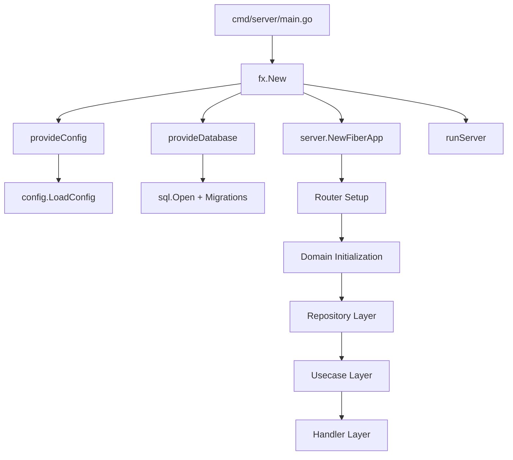
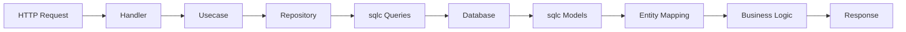
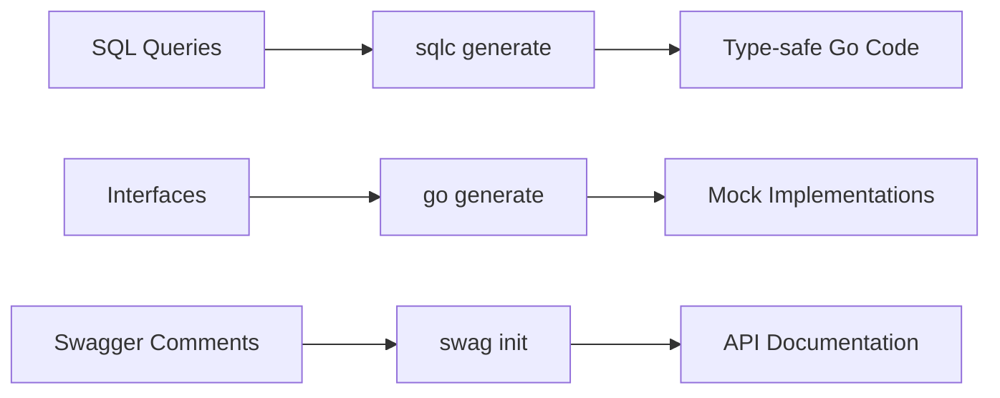

# Architecture Documentation

## System Design Overview

The Go Fiber Skeleton implements **Domain-Driven Clean Architecture** within a mono-repo structure, emphasizing strict domain isolation and adherence to SOLID principles.

## Core Architectural Patterns

### 1. Clean Architecture Layers

Each domain follows a 4-layer architecture pattern:

```
internal/domain/
├── entity/          # Domain models (pure Go structs)
├── repository/      # Data access interfaces + implementations
│   └── mocks/       # Auto-generated mocks for testing
├── usecase/         # Business logic interfaces + implementations
│   └── mocks/       # Auto-generated mocks for testing
└── handler/         # HTTP handlers and route registration
```

### 2. Dependency Injection Pattern

- **Framework**: Uber's fx for dependency injection and lifecycle management
- **Approach**: Constructor injection with interface-based dependencies
- **Lifecycle**: Automatic startup/shutdown hooks for graceful termination

### 3. Repository Pattern

- **Interface-first**: All repositories define interfaces before implementation
- **sqlc Integration**: Type-safe SQL generation from raw queries
- **Mock Generation**: Auto-generated mocks using `//go:generate` annotations

### 4. Domain Isolation

- **Zero Cross-Domain Dependencies**: Each domain is completely self-contained
- **Shared Infrastructure**: Common utilities in `/internal/*` directories
- **Independent Testability**: Each domain can be tested in isolation

## Component Relationships

### Application Bootstrap Flow



### Domain Data Flow



## Key Architectural Decisions

### 1. Technology Stack Choices

- **Web Framework**: Fiber v2 (Express.js-inspired, high performance)
- **Database**: PostgreSQL with pgx driver
- **Query Builder**: sqlc for compile-time type safety
- **Caching**: Redis/Valkey with graceful fallback
- **Authentication**: JWT with bcrypt password hashing
- **Configuration**: Viper with environment variable precedence

### 2. Database Architecture

- **Migration Strategy**: Versioned migrations using golang-migrate
- **Query Generation**: sqlc for type-safe database operations
- **Connection Pooling**: Configurable pool settings with health checks
- **Schema Design**: UUID primary keys, audit fields (created_at, updated_at)

### 3. Testing Strategy

- **Unit Testing**: Mock-based testing with go.uber.org/mock
- **Repository Testing**: Database mocking with DATA-DOG/go-sqlmock
- **Test Utilities**: Shared fixtures and helpers in `/internal/testutil`
- **Coverage**: Comprehensive test coverage requirements

### 4. API Design Patterns

- **Response Format**: JSend standard for consistent API responses
- **Error Handling**: Centralized error handling with proper HTTP status codes
- **Validation**: Request validation using validator/v10
- **Documentation**: Auto-generated Swagger/OpenAPI documentation
- **Middleware**: Request ID, logging, CORS, security, rate limiting

## Directory Structure

```
.
├── cmd/server/           # Application entry points
├── internal/
│   ├── config/          # Configuration management
│   ├── database/        # Database migration utilities
│   ├── db/             # sqlc-generated code
│   ├── cache/          # Redis client
│   ├── logger/         # Structured logging
│   ├── middleware/     # HTTP middleware
│   ├── response/       # Response formatting
│   ├── server/         # Router and app setup
│   ├── testutil/       # Testing utilities
│   ├── user/           # User domain
│   └── post/           # Post domain
├── db/
│   ├── migrations/     # Database migration files
│   └── queries/        # SQL query definitions
├── docs/               # Generated API documentation
└── compose.yml         # Development environment
```

## Domain Implementation Pattern

### Standard Domain Structure

Each domain follows this consistent pattern:

1. **Entity Layer**: Pure domain models with no external dependencies
2. **Repository Layer**: Data access interfaces with PostgreSQL implementations
3. **Usecase Layer**: Business logic interfaces with domain-specific implementations
4. **Handler Layer**: HTTP handlers with Swagger annotations

### Cross-Cutting Concerns

- **Authentication**: JWT-based stateless authentication
- **Authorization**: User ownership validation in usecases
- **Validation**: Request DTO validation with custom error messages
- **Logging**: Structured logging with request tracing
- **Error Handling**: Consistent error responses across all domains

## Development Workflow Integration

### Code Generation Pipeline



### Quality Assurance

- **Linting**: golangci-lint with comprehensive rule set
- **Testing**: Unit tests with mocks, integration tests with test database
- **Documentation**: Auto-generated API docs with Swagger
- **CI/CD**: Makefile-based automation for all development tasks

## Scalability Considerations

### Horizontal Scaling

- **Stateless Design**: JWT authentication enables horizontal scaling
- **Database Pooling**: Configurable connection pools for high concurrency
- **Caching Layer**: Redis integration for performance optimization
- **Graceful Shutdown**: Proper lifecycle management for zero-downtime deployments

### Vertical Scaling

- **Memory Efficiency**: Connection pooling and resource management
- **CPU Optimization**: Fiber's high-performance HTTP engine
- **Database Optimization**: Indexed queries and efficient schema design

## Security Architecture

### Authentication & Authorization

- **JWT Tokens**: Stateless authentication with configurable expiration
- **Password Security**: bcrypt hashing with cost factor
- **API Security**: Rate limiting, CORS, security headers middleware

### Data Protection

- **Input Validation**: Comprehensive request validation
- **SQL Injection Prevention**: sqlc-generated parameterized queries
- **Error Information**: Sanitized error responses to prevent information leakage

## Monitoring & Observability

### Logging Strategy

- **Structured Logging**: zerolog with consistent field naming
- **Request Tracing**: Unique request IDs for distributed tracing
- **Log Levels**: Configurable log levels for different environments

### Health Checks

- **Liveness Probe**: Basic application health check
- **Readiness Probe**: Database and Redis connectivity checks
- **Graceful Degradation**: Optional Redis with fallback behavior