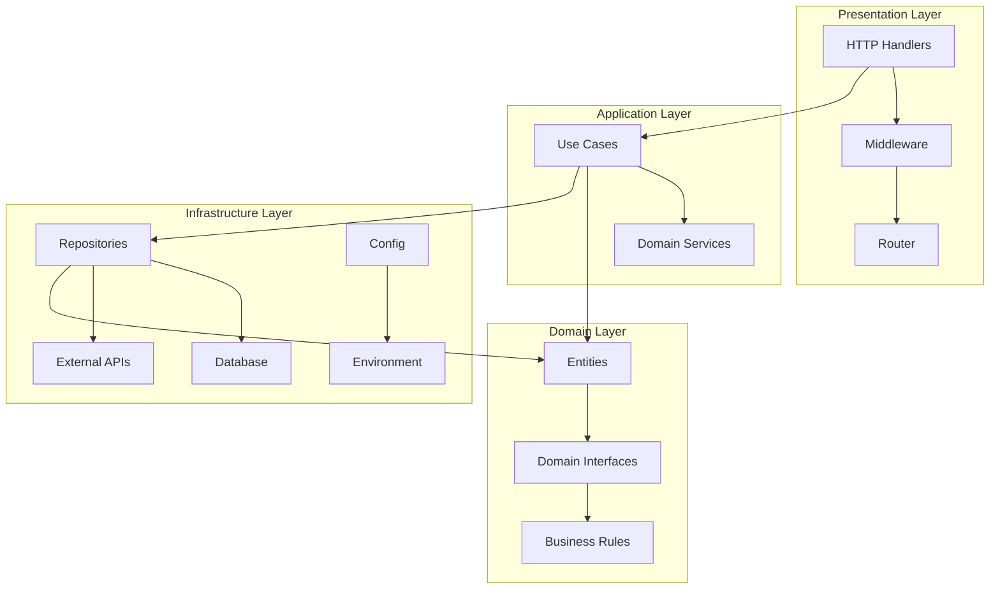
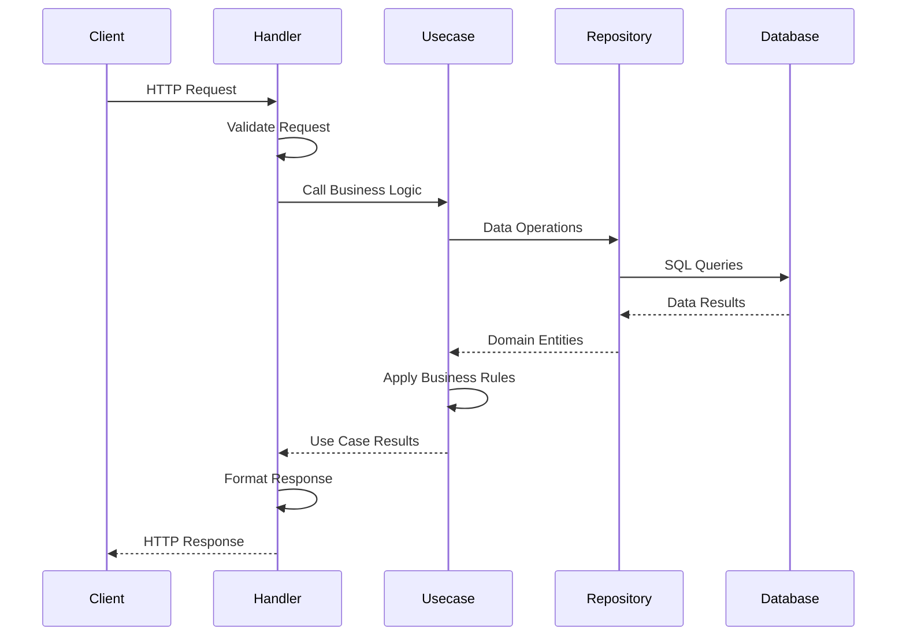
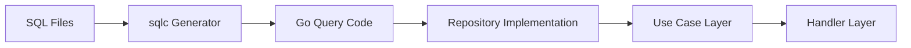
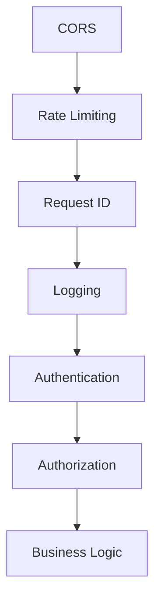
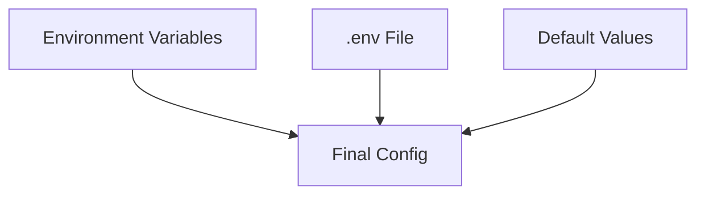
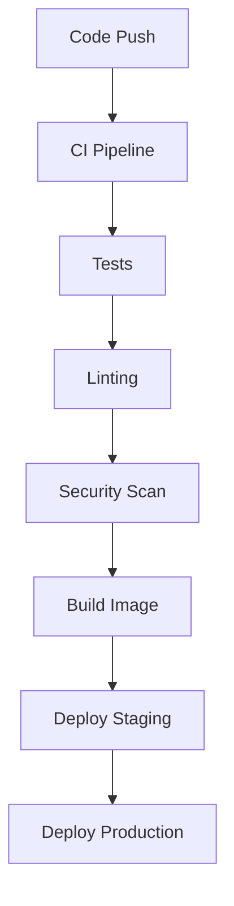

# **Architecture Documentation**

## **System Overview**

This Go Fiber skeleton implements **Domain-Driven Clean Architecture** with strict separation of concerns and SOLID principles. The architecture follows a mono-repo structure with isolated business domains, shared infrastructure, and comprehensive tooling for production-ready applications.

## **Architectural Patterns**

### **Clean Architecture Layers**



### **Directory Structure**

```
.
├── cmd/                    # Application entry points
│   ├── server/            # Main HTTP server
│   └── migrate/           # Database migration tool
├── internal/              # Private application code
│   ├── domains/          # Business domains
│   │   ├── user/         # User/auth domain
│   │   └── [domain]/     # Additional domains
│   ├── middleware/       # HTTP middleware
│   └── config/          # Configuration management
├── pkg/                  # Shared library code
│   ├── database/        # Database utilities
│   ├── cache/           # Cache utilities
│   └── response/        # Response formatting
├── db/                  # Database-related files
│   ├── migrations/      # SQL migration files
│   ├── queries/         # SQLC query files
│   └── seeds/           # Database seeds
├── docs/                # Generated documentation
├── configs/             # Configuration files
└── scripts/             # Utility scripts
```

## **Domain Architecture**

### **Domain Structure Pattern**

Each domain follows the same architectural pattern:

```
domains/[domain]/
├── entity/           # Domain entities and models
├── repository/       # Repository interfaces
├── usecase/          # Business logic use cases
├── delivery/         # HTTP handlers/transport
├── tests/            # Domain-specific tests
└── mocks/            # Generated mocks
```

### **Domain Components**

1. **Entity Layer**: Pure business objects with no external dependencies
2. **Repository Layer**: Data access interfaces for persistence
3. **Usecase Layer**: Application business logic and workflows
4. **Delivery Layer**: HTTP handlers and request/response processing

## **Data Flow Architecture**



## **Dependency Injection**

The project uses **Samber's do** for type-safe dependency injection:

```go
// Container setup
container := do.New()

// Register dependencies
do.Provide(container, NewConfig)
do.Provide(container, NewDatabase)
do.Provide(container, NewUserRepository)
do.Provide(container, NewUserUsecase)
do.Provide(container, NewUserHandler)
```

## **Database Architecture**

### **Database Components**

1. **Migrations**: Version-controlled schema changes using `golang-migrate`
2. **Queries**: Type-safe SQL queries using `sqlc`
3. **Repositories**: Data access layer with interface abstraction
4. **Connection Pooling**: Optimized database connection management

### **Database Flow**



## **Security Architecture**

### **Authentication & Authorization**

1. **JWT Authentication**: Stateless token-based authentication
2. **Password Hashing**: bcrypt for secure password storage
3. **Middleware Protection**: Route-level authentication checks
4. **Input Validation**: Request validation and sanitization

### **Security Middleware Stack**



## **Testing Architecture**

### **Testing Strategy**

1. **Unit Tests**: Isolated business logic testing with mocks
2. **Integration Tests**: Database and external service testing
3. **End-to-End Tests**: Full request/response cycle testing
4. **Mock Generation**: Automated mock generation with `go.uber.org/mock`

### **Test Structure**

```
tests/
├── unit/              # Unit tests with mocks
├── integration/       # Integration tests
├── e2e/              # End-to-end tests
└── fixtures/         # Test data fixtures
```

## **Configuration Architecture**

### **Configuration Management**

1. **Environment-Based**: Environment variables for production
2. **File-Based**: `.env` files for local development
3. **Type Safety**: Structured configuration with validation
4. **Precedence Rules**: Clear configuration override order



## **API Architecture**

### **RESTful API Design**

1. **Resource-Based URLs**: Clear resource naming conventions
2. **HTTP Methods**: Proper use of HTTP verbs
3. **Status Codes**: Consistent HTTP status code usage
4. **Response Format**: Structured JSON responses with JSend format

### **API Documentation**

1. **Swagger Generation**: Automatic API documentation from code comments
2. **Interactive Docs**: Browser-based API exploration
3. **Schema Definitions**: Clear request/response schemas

## **Deployment Architecture**

### **Containerization**

1. **Multi-stage Docker**: Optimized container builds
2. **Docker Compose**: Local development environment
3. **Health Checks**: Application health monitoring
4. **Configuration Injection**: Environment-based configuration

### **CI/CD Pipeline**



## **Performance Architecture**

### **Performance Optimizations**

1. **Connection Pooling**: Database connection management
2. **Caching Layer**: Redis/Valkey integration for caching
3. **Efficient Queries**: Optimized SQL with proper indexing
4. **Memory Management**: Proper resource cleanup and garbage collection

### **Monitoring & Observability**

1. **Structured Logging**: Consistent log formats
2. **Request Tracing**: Request ID propagation
3. **Error Tracking**: Comprehensive error handling
4. **Metrics Collection**: Performance monitoring capabilities

## **Scalability Architecture**

### **Scaling Considerations**

1. **Horizontal Scaling**: Stateless application design
2. **Database Scaling**: Connection pooling and query optimization
3. **Cache Strategy**: Distributed caching for performance
4. **Load Balancing**: Ready for load balancer deployment

### **Domain Scalability**

1. **Domain Isolation**: Independent domain development
2. **Microservice Ready**: Easy extraction to microservices
3. **Shared Infrastructure**: Common utilities and patterns
4. **Standardized Patterns**: Consistent development approach