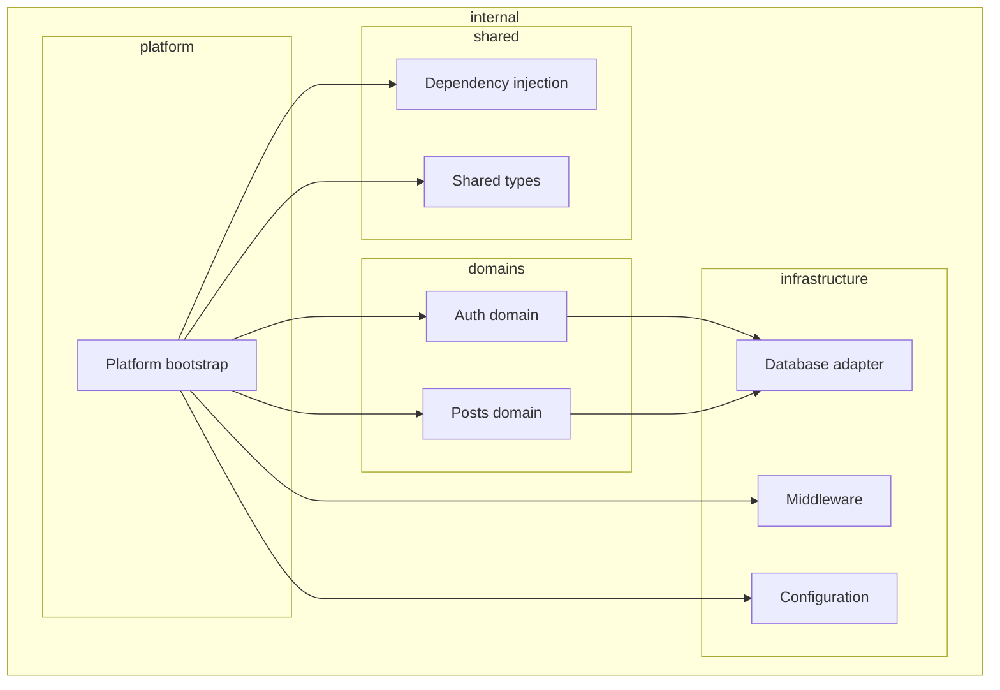

# System Architecture Overview

The application follows Domain-Driven Clean Architecture organized in a mono-repo:

## Codebase Structure

Key directories:
- `cmd/server`: application entry point and bootstrap  
- `cmd/migrate`: migration runner  
- `internal/platform`: framework bootstrap (Fiber server)  
- `internal/domains`: domain modules with entities, biz, api, store, handlers, routes, tests  
- `internal/infrastructure`: shared infrastructure code for database, middleware, config  
- `internal/shared`: shared DI container modules and shared types  
- `db`: sqlc generated queries and migrations  
- `docs`: swagger and production guidance  

## Component Interactions

- The `platform` module loads configuration, sets up database and DI container, and registers routes.  
- Each domain module defines its own entities, business logic, repository interfaces, HTTP adapters, and tests.  
- Infrastructure modules provide implementations for database adapters, middleware, logging, and validation.  
- Shared modules manage dependency injection and common utilities.  