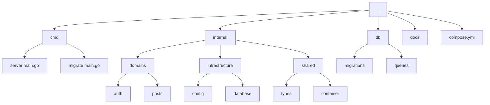
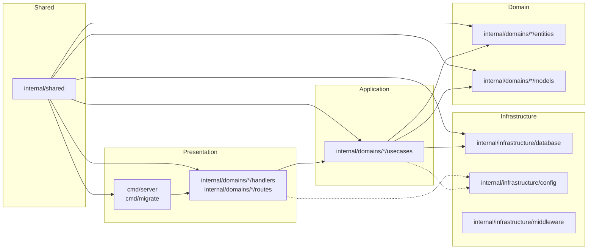

# Architecture

This project adopts Domain-Driven Clean Architecture with clear boundaries between presentation, application, domain, and infrastructure layers. It is optimized for Go Fiber services, explicit dependency injection via fx, and environment-driven configuration through Viper.

Related docs:
- Brief: [.agents/rules/memory-bank/brief.md](.agents/rules/memory-bank/brief.md)
- Product: [.agents/rules/memory-bank/product.md](.agents/rules/memory-bank/product.md)
- Tech: [.agents/rules/memory-bank/tech.md](.agents/rules/memory-bank/tech.md)
- Tasks: [.agents/rules/memory-bank/tasks.md](.agents/rules/memory-bank/tasks.md)

## System Overview

- HTTP layer is provided by Go Fiber v2 with production middlewares for logging, recovery, auth, and CORS.
- Business logic is encapsulated in domain-specific usecases that depend on repository interfaces.
- Data access implementations are provided in infrastructure adapters (e.g., PostgreSQL v17 via pgx with sqlc).
- Caching and distributed state are handled by Valkey v8 (Redis-compatible) for caching, rate limiting, and session data.
- Dependency injection and lifecycle management are handled by fx for consistent initialization and teardown.
- Configuration is centralized using Viper with support for config files, environment variables, and sensible defaults.
- Responses follow jsend formatting for consistency across success, fail, and error outcomes.

## Design Principles
- Simplicity: favor straightforward Go idioms and minimal abstractions over unnecessary complexity.
- SOLID: enforce single responsibility, open–closed, Liskov substitution, interface segregation, and dependency inversion principles in package and module design.

## Codebase Structure (target)

```
.
├── cmd/
│   ├── server/main.go          # Entry point
│   └── migrate/main.go         # Migration runner
├── internal/
│   ├── domains/                # Domain modules
│   │   ├── auth/
│   │   │   ├── entities/
│   │   │   ├── usecases/
│   │   │   ├── repositories/
│   │   │   ├── handlers/
│   │   │   ├── routes/
│   │   │   ├── models/
│   │   │   ├── mocks/          # Generated via mockgen (per-domain)
│   │   │   └── tests/
│   │   └── posts/
│   ├── infrastructure/
│   │   ├── database/
│   │   ├── middleware/
│   │   └── config/
│   └── shared/
│       ├── types/
│       └── container/
├── db/
│   ├── migrations/             # All SQL migrations (only here)
### Proposed Simplified Directory Layout


│   └── queries/                # All SQL query files for sqlc (centralized)
├── docs/
└── compose.yml
```

## Layered Clean Architecture Overview


Notes:
- All migrations and SQL query files are consolidated under [db](db).
- No queries or migrations should live under internal/* or top-level migrations/; the legacy [migrations](migrations) path is deprecated.

## Database Layout Policy

Canonical locations:
- Migrations: [db/migrations](db/migrations)
- Queries: [db/queries](db/queries) (flat; do not nest per-domain subfolders)

Rationale:
- Single source of truth for schema and SQL improves discoverability and tooling.
- Flat queries directory keeps sqlc configuration simple and avoids cross-domain coupling through folder structure.

Implications:
- sqlc must be configured to read from [db/queries](db/queries) and output generated code into the appropriate package, typically under [internal/infrastructure/database/queries](internal/infrastructure/database/queries).
- Migration tooling (golang-migrate) must point to [db/migrations](db/migrations).

## Configuration (Viper)

Canonical environment variables for database configuration:
- DB_HOST
- DB_PORT
- DB_USER
- DB_PASSWORD
- DB_NAME
- DB_SCHEMA
- DB_SSLMODE

Precedence and fallbacks:
- Database: Prefer DB_* variables. If DB_* are not set, accept DB_URL. If both are present, DB_* take precedence. DATABASE_URL is deprecated; when a URL is required, construct from DB_* and include search_path set to DB_SCHEMA where applicable.
- Valkey: Prefer VALKEY_* variables (VALKEY_HOST, VALKEY_PORT, VALKEY_PASSWORD, VALKEY_DB). If VALKEY_* are not set, accept VALKEY_URL. If both are present, VALKEY_* take precedence. REDIS_URL is deprecated.

Other common variables include PORT, ENV, JWT_SECRET, JWT_EXPIRES_IN, VALKEY_* or VALKEY_URL, and CORS_ORIGINS. See [Tech](.agents/rules/memory-bank/tech.md) for full details.

## Mocks and Testability

- Each domain owns a mocks package under its path: [internal/domains/<domain>/mocks](internal/domains/).
- Mocks are generated with go.uber.org/mock/mockgen from repository interfaces in the same domain.
- Tests that hit the database layer should use DATA-DOG/go-sqlmock to avoid real data access.

Example generator command (run from repo root):
```bash
mockgen -source ./internal/domains/posts/repositories/interface.go \
  -destination ./internal/domains/posts/mocks/mock_repository.go \
  -package mocks
```

## Request Lifecycle and Layers

- Routing: Fiber registers versioned routes under /api/v1 and composes middlewares.
- Middlewares: Logger, Recover, CORS, and Auth are applied in that order for robust request handling.
- Handlers: Translate HTTP requests to typed DTOs, perform validation, and invoke usecases.
- Usecases: Orchestrate domain workflows and depend on repository interfaces only.
- Repositories: Implement persistence against concrete data stores (e.g., Postgres) behind interfaces.
- Models and Entities: Entities capture domain invariants; models provide request and response DTOs.
- Responses: All responses are formatted using jsend for consistency.

## Dependency Injection and Lifecycle (fx)

- The container wires constructors for configuration, database connections, and other infrastructure.
- Usecases and handlers are provided via constructors that declare their dependencies.
- Lifecycle hooks ensure resources (like db pools) are started and stopped gracefully.

Benefits:
- Explicit dependencies
- Testable components with mockable interfaces
- Predictable startup and teardown ordering

## Middleware Stack

Ordering recommendation:
1. Logger
2. Recover
3. CORS
4. Auth
5. Routes

## Error Handling and Response Format

- Errors are mapped to appropriate HTTP status codes.
- Client-side issues return jsend fail with actionable messages.
- Server-side issues return jsend error to avoid leaking internals.
- Validation errors are aggregated and presented in a consistent structure.

## Observability

- Structured logs include timestamp, status, method, path, latency, IP, user agent.
- Panic traces are captured by Recover middleware.
- Health and readiness endpoints can be added to support orchestration platforms and load balancers.
- Extend with metrics and tracing as needed.

## Build and Runtime Flows

- Development:
  - Air provides hot reload for rapid iteration.
  - Run migrations locally before server start.
  - Swagger docs can be generated via swaggo.
- Production:
  - Multi-stage Docker builds produce small, secure images.
  - Environment variables control behavior without code changes.
  - Readiness probes ensure traffic only reaches healthy instances.

## Current Repository State and Gaps

The current repository contains legacy SQL and migration locations that will be refactored to match this architecture:
- Legacy migrations at [migrations](migrations) must be moved to [db/migrations](db/migrations).
- Legacy queries at [internal/queries](internal/queries) and [internal/infrastructure/database/queries](internal/infrastructure/database/queries) must be consolidated into [db/queries](db/queries) with sqlc.yaml updated accordingly.

Until refactoring is complete, treat db/* as the source of truth and plan deprecation of the legacy paths.

## Architecture Diagram

```mermaid
flowchart LR
Client --> Router
Router --> Logger
Logger --> Recover
Recover --> CORS
CORS --> Auth
Auth --> Handlers
Handlers --> Usecases
Usecases --> Repositories
Repositories --> Postgres
Repositories --> Valkey
Config --> Logger
Config --> CORS
Config --> Auth
FX --> Handlers
FX --> Usecases
FX --> Repositories