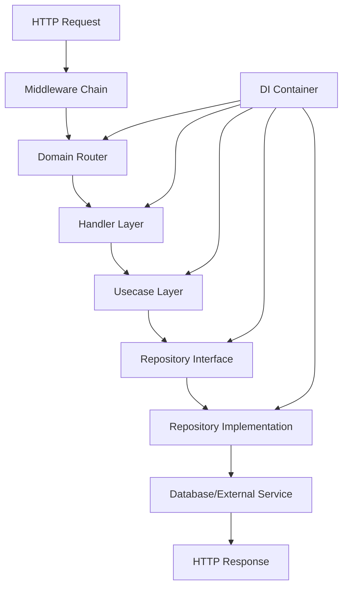

# **System Architecture: Go Fiber Skeleton**

## **1. Architecture Overview**

Production-ready Go backend template implementing **Domain-Driven Clean Architecture** with **strict domain isolation** and **SOLID principles**. **Eliminates 80-90% of initial project setup work** by providing complete infrastructure, tooling, and reference implementation.

### **Core Principles**

* **Clean Architecture Layers:** Domain → Application → Infrastructure
* **Domain-Driven Design:** Business logic encapsulated in isolated domains
* **Dependency Injection:** Type-safe DI with Samber's do framework
* **Mono-repo Structure:** Organized codebase with clear boundaries
* **Test-Driven Development:** Comprehensive testing with mocks

## **2. Directory Structure**

```
gofiber-skeleton/
├── cmd/server/                 # Application entry point
├── internal/
│   ├── domains/               # Business domains (DDD)
│   │   ├── user/              # Reference domain
│   │   │   ├── entity/        # Domain models
│   │   │   ├── repository/    # Repository interfaces
│   │   │   ├── usecase/       # Business logic
│   │   │   ├── handler/       # HTTP handlers
│   │   │   └── router/        # Domain-specific routes
│   │   └── post/              # Example domain
│   │       ├── entity/
│   │       ├── repository/
│   │       ├── usecase/
│   │       ├── handler/
│   │       └── router/
│   ├── infrastructure/        # External implementations
│   │   ├── config/           # Configuration
│   │   ├── database/         # Database setup
│   │   └── di/               # Dependency injection container
│   └── shared/               # Shared utilities
│       ├── middleware/       # HTTP middleware
│       ├── response/         # Response utilities
│       ├── validator/        # Input validation
│       └── router/           # Router interfaces
├── db/
│   ├── migrations/           # Schema migrations
│   └── queries/              # SQL queries for sqlc
├── docs/                     # Documentation
├── scripts/                  # Utility scripts
├── compose.yml              # Development environment
├── Dockerfile               # Production container
└── Makefile                 # Development commands
```

## **3. Request Flow**



## **4. Layer Dependencies**

* **Handler:** Depends on Usecase interfaces
* **Usecase:** Depends on Repository interfaces + Domain entities
* **Repository:** Implements interfaces, depends on infrastructure
* **Entity:** Pure domain models, no external dependencies
* **Infrastructure:** Provides implementations for inner layers

## **5. Domain Pattern**

Each domain follows this consistent structure:

1. **Entity:** Core business models with validation
2. **Repository:** Interface definitions for data access
3. **Usecase:** Business logic with dependency injection
4. **Handler:** HTTP endpoints with Swagger documentation
5. **Router:** Domain-specific route registration

## **6. Technology Integration**

### **Database Layer**
* **PostgreSQL:** Primary database with pgx driver
* **Migrations:** golang-migrate for schema versioning
* **Queries:** sqlc for type-safe SQL generation
* **Transactions:** Consistent transaction handling

### **Web Layer**
* **Fiber v2:** High-performance web framework
* **Middleware:** CORS, security, rate limiting, logging
* **Authentication:** JWT-based stateless auth
* **Documentation:** Auto-generated Swagger/OpenAPI

### **Dependency Injection with Samber/do**
* **Framework:** Samber's do - type-safe DI container with generics
* **Core Benefits:**
  - Compile-time dependency validation
  - Automatic service lifecycle management
  - Type-safe dependency resolution
  - Singleton and scoped service management
* **Integration Pattern:**
  - All services registered in DI container at startup
  - Dependencies injected through constructor parameters
  - Domain services automatically resolved and wired
  - Clean separation of concerns with interface-based design

### **Domain-Based Routing Architecture**
* **Self-Registering Routes:** Each domain registers its own routes with main router
* **DI Integration:** Route handlers receive dependencies through DI container
* **Pattern Implementation:**
  - `internal/domains/{domain}/router/` - Domain-specific route definitions
  - Routes automatically discovered and registered at application startup
  - Middleware applied per domain or globally
  - Clean separation of routing concerns by domain
* **Benefits:**
  - Modular route management
  - Automatic dependency injection for handlers
  - Domain isolation and independence
  - Easy testing with mocked dependencies

### **Additional Development Tools**
* **Configuration:** Viper with environment hierarchy
* **Testing:** uber-go/mock for interface mocking
* **Hot Reloading:** Air for development efficiency

## **7. Reference Implementation**

The **user and post domains** demonstrate all architectural patterns:

* **Entity:** User and Post models with proper validation
* **Repository:** PostgreSQL integration with sqlc
* **Usecase:** Business logic with DI-driven dependencies
* **Handler:** HTTP endpoints with comprehensive tests
* **Router:** Self-registering domain routes with middleware
* **DI Container:** Automatic service resolution and lifecycle management
* **Testing:** 90%+ coverage with proper mocking

## **8. Configuration Management**

### **Priority Order**
1. Environment Variables (production)
2. .env File (development)
3. Default Values (fallback)

### **Key Areas**
* Server settings (host, port, timeouts)
* Database configuration (connection, pooling)
* JWT settings (secrets, expiration)
* Logging configuration (levels, output)

## **9. Testing Strategy**

* **Unit Tests:** Business logic with mocked dependencies
* **Integration Tests:** Database and external service testing
* **Handler Tests:** HTTP endpoint testing
* **Mock Generation:** Automatic with //go:generate annotations

## **10. Production Considerations**

### **Containerization & Deployment**
* **Multi-stage Docker builds:** Optimized production images
* **Health checks:** Liveness and readiness probes
* **Graceful shutdown:** Proper resource cleanup on termination
* **Resource limits:** CPU and memory constraints
* **Security scanning:** Container vulnerability assessment

### **Observability & Monitoring**
* **Structured logging:** JSON-formatted logs with correlation IDs
* **Metrics collection:** Application performance metrics
* **Error tracking:** Centralized error reporting
* **Request tracing:** Distributed tracing for debugging
* **Health monitoring:** External dependency health checks

### **Security Best Practices**
* **Input validation:** Comprehensive validation and sanitization
* **Rate limiting:** API endpoint protection
* **CORS configuration:** Proper cross-origin resource sharing
* **Security headers:** HSTS, CSP, X-Frame-Options
* **Secrets management:** Environment-based configuration
* **Dependency updates:** Regular security patching

### **Performance Optimization**
* **Connection pooling:** Database connection optimization
* **Caching strategy:** Multi-level caching implementation
* **Response compression:** Gzip for API responses
* **Database indexing:** Proper query optimization
* **Memory management:** Efficient Go patterns

### **Scalability Considerations**
* **Horizontal scaling:** Stateless application design
* **Database scaling:** Read replicas and connection management
* **Load balancing:** Multiple instance support
* **Caching layer:** Distributed caching with Valkey
* **Background jobs:** Asynchronous task processing