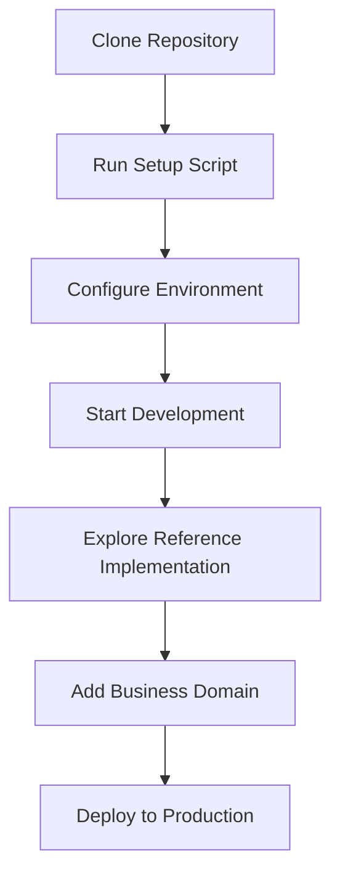
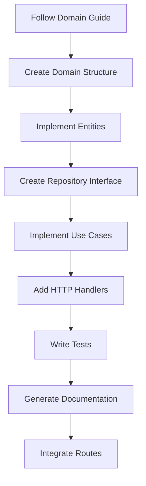
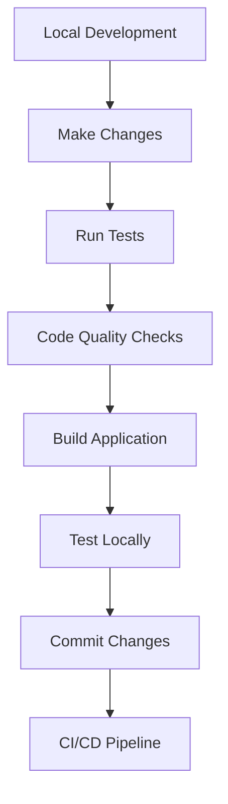

# **Product Documentation**

## **Product Purpose**

The Go Fiber Production-Ready Template is a **developer productivity tool** designed to eliminate 80-90% of initial project setup work for Go backend services. It provides a complete, production-ready foundation that enables developers to focus on business logic rather than infrastructure configuration.

## **Target Users**

### **Primary Users**
- **Development Teams** starting new Go backend projects
- **Individual Developers** building production applications
- **Startups** needing rapid development without sacrificing quality

### **Secondary Users**
- **Organizations** standardizing on Go for microservices
- **Enterprises** requiring consistent architecture across teams
- **Developers** learning Go best practices with real-world examples

## **User Goals & Objectives**

### **Primary Goals**
1. **Accelerate Development**: Start building business logic within minutes
2. **Ensure Quality**: Built-in best practices and architectural patterns
3. **Production Ready**: Deploy to production with minimal configuration
4. **Maintain Consistency**: Standardized patterns across projects and teams

### **Success Metrics**
- **Time to First API**: < 5 minutes from clone to running server
- **Domain Addition Time**: < 1 hour to add new CRUD domain
- **Test Coverage**: 90%+ coverage with built-in testing patterns
- **Deployment Readiness**: Production deployment in < 30 minutes

## **User Workflows**

### **New Project Setup Workflow**

**Time Investment:**
- Clone & Initialize: 5 minutes
- Explore Reference: 15 minutes
- Add First Domain: 30-60 minutes
- Deploy to Production: varies

### **Domain Development Workflow**

**Key Activities:**
- Follow `docs/ADDING_NEW_DOMAIN.md` guide
- Use user domain as reference pattern
- Implement all layers with proper testing
- Generate API documentation automatically

### **Development Workflow**

**Daily Development Commands:**
- `make dev` - Start development with hot reload
- `make test` - Run comprehensive test suite
- `make lint` - Code quality checks
- `make build` - Build production binary

## **Core Features & Benefits**

### **Development Experience Features**

1. **Hot Reloading**: Automatic server restart on file changes
2. **Type Safety**: Compile-time SQL validation with sqlc
3. **Mock Generation**: Automated test mock generation
4. **API Documentation**: Auto-generated Swagger documentation
5. **Comprehensive Tooling**: Makefile with all common tasks

### **Production Features**

1. **Security**: JWT authentication, input validation, CORS
2. **Performance**: Connection pooling, caching, optimized queries
3. **Monitoring**: Structured logging, health checks, request tracing
4. **Scalability**: Stateless design, ready for horizontal scaling
5. **Deployment**: Docker containerization, CI/CD pipelines

### **Quality Assurance Features**

1. **Testing**: Unit, integration, and end-to-end tests
2. **Code Quality**: golangci-lint with comprehensive rules
3. **Security Scanning**: Automated vulnerability detection
4. **Documentation**: In-code documentation with examples
5. **Best Practices**: Clean Architecture, SOLID principles

## **Value Proposition**

### **What Developers Save**

**Time Savings:**
- No research on best practices: 20-40 hours
- No tooling setup: 10-20 hours
- No boilerplate writing: 40-60 hours
- No configuration management: 10-15 hours
- No auth implementation: 20-30 hours

**Total Time Saved: 100-165 hours per project**

### **Quality Improvements**

**Built-in Quality:**
- Production-ready architecture
- Comprehensive testing patterns
- Security best practices
- Performance optimizations
- Code quality standards

## **Use Case Scenarios**

### **Scenario 1: Startup MVP Development**
- **Timeline**: 2-3 weeks instead of 6-8 weeks
- **Team Size**: 1-3 developers
- **Focus**: Business logic and user features
- **Outcome**: Production-ready MVP with proper testing

### **Scenario 2: Enterprise Microservice**
- **Timeline**: 1-2 weeks instead of 4-6 weeks
- **Team Size**: 2-5 developers
- **Focus**: Domain implementation and integration
- **Outcome**: Standards-compliant microservice with full documentation

### **Scenario 3: API Gateway Service**
- **Timeline**: 1 week instead of 3-4 weeks
- **Team Size**: 1-2 developers
- **Focus**: Authentication, routing, and middleware
- **Outcome**: Secure, scalable API gateway with monitoring

### **Scenario 4: Learning & Prototyping**
- **Timeline**: Immediate start
- **Team Size**: 1 developer
- **Focus**: Learning Go best practices
- **Outcome**: Production-ready prototype with proper patterns

## **User Success Stories**

### **Development Team Success**
- **Challenge**: New project with tight deadline
- **Solution**: Used template to eliminate setup work
- **Result**: Delivered production-ready service in 2 weeks
- **Benefit**: Focused 100% on business logic

### **Startup Success**
- **Challenge**: Limited resources, need for rapid development
- **Solution**: Template provided enterprise-grade foundation
- **Result**: Launched MVP with proper testing and documentation
- **Benefit**: Investor confidence with professional codebase

### **Enterprise Success**
- **Challenge**: Standardizing architecture across teams
- **Solution**: Template as organizational standard
- **Result**: Consistent, high-quality microservices
- **Benefit**: Reduced onboarding time and maintenance overhead

## **Competitive Advantages**

### **vs. Building from Scratch**
- **Speed**: 10x faster initial development
- **Quality**: Built-in best practices vs. learning curve
- **Maintenance**: Proven patterns vs. experimental approaches
- **Risk**: Reduced technical debt vs. unknown architecture

### **vs. Other Frameworks**
- **Go Performance**: Superior performance and concurrency
- **Clean Architecture**: Better separation of concerns
- **Type Safety**: Compile-time error detection
- **Production Ready**: Complete deployment setup

### **vs. Low-code Solutions**
- **Flexibility**: Complete control over implementation
- **Scalability**: No vendor limitations
- **Customization**: Tailored to specific needs
- **Performance**: Optimized for specific use cases

## **Product Evolution**

### **Current State**
- Production-ready template with comprehensive features
- Complete reference implementation (user/auth domain)
- Extensive documentation and guides
- Active maintenance and updates

### **Future Enhancements**
- Additional domain templates
- Performance monitoring dashboards
- Advanced security features
- Cloud deployment integrations
- Performance benchmarking tools

## **Support & Community**

### **Documentation Resources**
- `TEMPLATE_SETUP.md`: Complete setup guide
- `docs/ADDING_NEW_DOMAIN.md`: Domain addition guide
- In-code documentation and examples
- Comprehensive README with setup instructions

### **Development Support**
- Reference implementation as learning tool
- Comprehensive test examples
- Best practices documentation
- Architectural decision records

### **Community Resources**
- GitHub issues and discussions
- Contribution guidelines
- Code review processes
- Knowledge sharing platforms