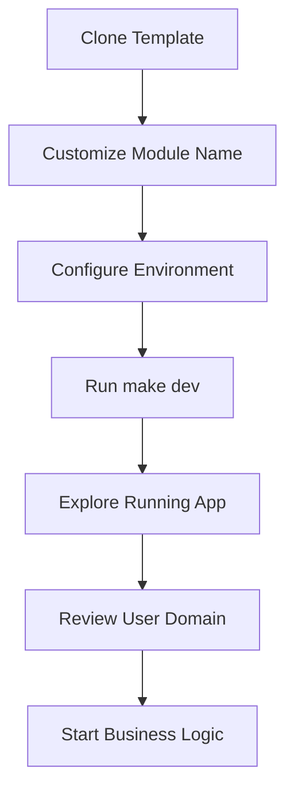
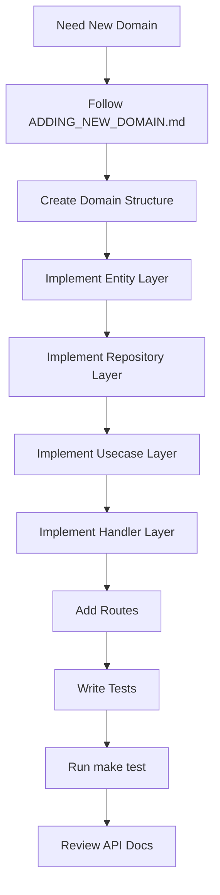

# **Product Vision: Go Fiber Skeleton**

## **1. Vision & Mission**

**Vision:** The most comprehensive Go backend template that eliminates 80-90% of initial setup work, enabling developers to focus on business logic from day one.

**Mission:** Accelerate Go backend development by providing a complete, well-architected foundation that demonstrates best practices and serves as both a starting point and learning resource.

## **2. Target Personas**

### **Primary Users**

**Development Teams** starting new Go projects
* **Pain:** Inconsistent architecture, time-consuming setup
* **Needs:** Standardized patterns, quick start, comprehensive docs
* **Goals:** Accelerate development, maintain quality, scale effectively

**Individual Developers** building production apps
* **Pain:** Limited time, learning curve for best practices
* **Needs:** Ready-to-use foundation, clear examples
* **Goals:** Ship quality code quickly, learn Go best practices

### **Secondary Users**

**Organizations** standardizing on Go
* **Pain:** Inconsistent implementations, onboarding challenges
* **Needs:** Standardized patterns, team alignment
* **Goals:** Team consistency, faster delivery, knowledge sharing

**Startups** needing rapid development
* **Pain:** Limited resources, scalability concerns
* **Needs:** Quick start, production-ready patterns
* **Goals:** Quick market entry, technical debt minimization

## **3. User Workflows**

### **New Project Setup (5-Minute Workflow)**

**Success Metrics:**
* ✅ Complete setup in <5 minutes
* ✅ No configuration errors
* ✅ All services running correctly
* ✅ API documentation accessible

### **Domain Addition (1-Hour Workflow)**

**Success Metrics:**
* ✅ Complete domain in <1 hour
* ✅ All tests passing
* ✅ API documentation generated
* ✅ Following established patterns

### **Learning Journey**

1. **Exploration:** Review template structure and docs
2. **Understanding:** Study user domain implementation
3. **Implementation:** Add first custom domain
4. **Mastery:** Customize and extend patterns

## **4. Core Features**

### **Foundation Features**
* Complete Clean Architecture implementation
* Reference user/auth domain
* Development environment with Docker Compose
* Environment-aware configuration system
* Database integration with migrations

### **Developer Experience**
* Hot reloading with Air
* Comprehensive testing framework
* Code quality tools (golangci-lint)
* Auto-generated API documentation
* Makefile with common commands

### **Production-Ready**
* JWT authentication system
* Security headers and best practices
* Optimized Docker configuration
* Health check endpoints
* Structured logging

## **5. Value Propositions**

### **For Development Teams**
* **Time Savings:** Eliminate weeks of initial setup
* **Consistency:** Standardized architecture across projects
* **Quality:** Built-in best practices and code quality
* **Scalability:** Proven patterns that grow with teams

### **For Individual Developers**
* **Speed:** Start building business logic immediately
* **Learning:** Real-world Go best practices examples
* **Confidence:** Production-ready foundation
* **Growth:** Understanding of enterprise architecture

### **For Organizations**
* **Standardization:** Consistent patterns across teams
* **Onboarding:** Faster team member integration
* **Maintenance:** Reduced overhead with proven patterns
* **Innovation:** More time for business logic

## **6. Success Metrics & KPIs**

### **Adoption Metrics**
* Clone count and GitHub engagement
* Community contributions and issues
* Documentation engagement analytics
* Template usage in production

### **Developer Experience Metrics**
* **Setup Time:** Target <5 minutes (measured)
* **Domain Addition:** Target <1 hour (measured)
* **Issue Resolution:** Time to resolve setup problems
* **Documentation Satisfaction:** User feedback scores

### **Quality Metrics**
* **Test Coverage:** 90%+ in reference implementation
* **Code Quality:** golangci-lint score
* **Security:** Zero critical vulnerabilities
* **Performance:** Benchmark against baseline

## **7. Competitive Advantages**

### **Key Differentiators**
* **Complete Reference Implementation:** Full working example domain
* **Clean Architecture Focus:** Emphasis on maintainable patterns
* **Modern Go Practices:** Latest Go features and best practices
* **Comprehensive Documentation:** Complete setup and domain guides
* **Production Ready:** Production features and configurations

### **vs. Alternatives**
* **Other Templates:** More comprehensive reference implementation
* **Code Generators:** Better architecture and learning value
* **Enterprise Frameworks:** More flexible and educational
* **DIY Setup:** 80-90% time savings

## **8. Product Roadmap**

### **Phase 1: Foundation (Current)**
* ✅ Complete core template
* ✅ Comprehensive documentation
* ✅ Reference implementation
* 🔄 Memory Bank optimization

### **Phase 2: Enhancement**
* Additional reference domains
* Advanced features (monitoring, tracing)
* Integration examples
* Video tutorials

### **Phase 3: Ecosystem**
* Plugin system support
* Cloud deployment guides
* Microservices patterns
* Community contributions

## **9. User Feedback Integration**

### **Feedback Channels**
* GitHub Issues (bugs, features)
* GitHub Discussions (questions, sharing)
* Surveys (satisfaction, improvements)
* Analytics (usage patterns)

### **Integration Process**
1. Collect feedback from all channels
2. Analyze for patterns and priorities
3. Incorporate into roadmap planning
4. Implement high-priority items
5. Communicate changes to users

## **10. Risk Mitigation**

### **Product Risks**
* **Go Ecosystem Changes:** Regular updates and community engagement
* **Competitive Pressure:** Continuous improvement and differentiation
* **Maintenance Overhead:** Community contributions and automation

### **Usage Risks**
* **Misuse:** Clear documentation and use case guidance
* **Outdated Patterns:** Regular reviews and updates
* **Security Issues:** Regular audits and updates

## **11. Success Criteria**

### **Template Success**
A developer should be able to:
* ✅ Clone and run template in <5 minutes
* ✅ Understand architecture from user domain
* ✅ Add new CRUD domain in <1 hour
* ✅ Deploy to production with minimal config
* ✅ Maintain high code quality with built-in tools
* ✅ Scale application by adding more domains

### **Business Success**
* Become the go-to Go backend template
* Establish strong community adoption
* Enable hundreds of successful projects
* Contribute to Go ecosystem best practices