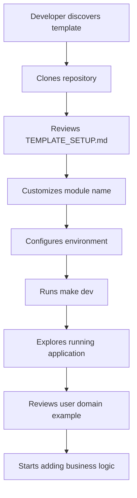
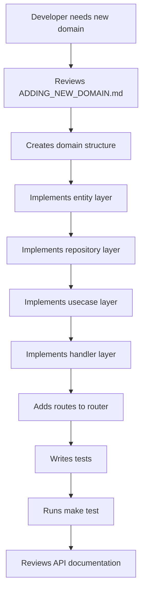

# **Product Vision: Go Fiber Skeleton**

## **1. Product Vision and Mission**

### **Vision Statement**

To provide the most comprehensive, production-ready Go backend template that eliminates 80-90% of initial project setup work, enabling developers to focus on business logic rather than infrastructure configuration.

### **Mission Statement**

To accelerate Go backend development by providing a complete, well-architected foundation that demonstrates best practices, includes comprehensive tooling, and serves as both a starting point and learning resource for developers.

## **2. Target Audience and Personas**

### **Primary Target Audience**

* **Development Teams** starting new Go backend projects
  - **Pain Points:** Inconsistent architecture patterns, time-consuming setup, lack of best practices
  - **Needs:** Standardized architecture, quick start, comprehensive documentation
  - **Goals:** Accelerate development, maintain code quality, scale effectively

* **Individual Developers** building production applications
  - **Pain Points:** Limited time for infrastructure setup, learning curve for best practices
  - **Needs:** Ready-to-use foundation, clear examples, learning resources
  - **Goals:** Ship quality code quickly, learn Go best practices, build scalable applications

### **Secondary Target Audience**

* **Organizations** standardizing on Go for microservices
  - **Pain Points:** Inconsistent implementations across teams, onboarding challenges
  - **Needs:** Standardized patterns, team alignment, reduced onboarding time
  - **Goals:** Team consistency, faster delivery, knowledge sharing

* **Startups** needing rapid development without sacrificing quality
  - **Pain Points:** Limited resources, need for quick MVP, future scalability concerns
  - **Needs:** Quick start, production-ready patterns, scalability built-in
  - **Goals:** Quick market entry, technical debt minimization, future-proof architecture

* **Developers** learning Go best practices with real-world examples
  - **Pain Points:** Theoretical knowledge vs. practical application, lack of comprehensive examples
  - **Needs:** Real-world patterns, complete implementations, learning resources
  - **Goals:** Practical skills, industry best practices, portfolio-worthy projects

## **3. User Workflows and Journeys**

### **New Project Setup Workflow**

### **Domain Addition Workflow**

### **Learning Journey**

1. **Exploration Phase:** Review template structure and documentation
2. **Understanding Phase:** Study user domain reference implementation
3. **Implementation Phase:** Add first custom domain following patterns
4. **Mastery Phase:** Customize and extend patterns for specific needs

## **4. Core Features and Capabilities**

### **Foundation Features**

* **Complete Architecture:** Clean Architecture with Domain-Driven Design
* **Reference Implementation:** Full user/auth domain demonstrating all patterns
* **Development Environment:** Docker Compose setup with all services
* **Configuration Management:** Environment-aware configuration system
* **Database Integration:** PostgreSQL with migrations and type-safe queries

### **Development Experience Features**

* **Hot Reloading:** Automatic server restart during development
* **Testing Framework:** Comprehensive testing with mocks and examples
* **Code Quality:** Linting and formatting with golangci-lint
* **API Documentation:** Auto-generated Swagger/OpenAPI documentation
* **Build System:** Makefile with common development commands

### **Production-Ready Features**

* **Authentication:** JWT-based stateless authentication
* **Security:** Comprehensive security headers and best practices
* **Containerization:** Optimized Docker configuration
* **Health Checks:** Application health monitoring endpoints
* **Logging:** Structured logging for production monitoring

## **5. User Value Propositions**

### **For Development Teams**

* **Time Savings:** Eliminate 80-90% of initial project setup work
* **Consistency:** Standardized architecture patterns across projects
* **Quality:** Built-in best practices and code quality tools
* **Scalability:** Proven architecture that scales with team growth

### **For Individual Developers**

* **Speed:** Start building business logic immediately
* **Learning:** Real-world examples of Go best practices
* **Confidence:** Production-ready foundation for applications
* **Growth:** Understanding of enterprise-grade architecture patterns

### **For Organizations**

* **Standardization:** Consistent patterns across teams and projects
* **Onboarding:** Faster onboarding for new team members
* **Maintenance:** Reduced maintenance overhead with proven patterns
* **Innovation:** More time for business logic innovation

## **6. Success Metrics and KPIs**

### **Adoption Metrics**

* **Clone Count:** Number of times template is cloned
* **Stars and Forks:** GitHub engagement metrics
* **Community Contributions:** Pull requests and issues
* **Documentation Views:** Documentation engagement analytics

### **Developer Experience Metrics**

* **Setup Time:** Time from clone to running application (target: <5 minutes)
* **Domain Addition Time:** Time to add new domain (target: <1 hour)
* **Issue Resolution:** Time to resolve setup issues
* **Documentation Satisfaction:** User feedback on documentation quality

### **Quality Metrics**

* **Test Coverage:** Reference implementation test coverage (target: 90%+)
* **Code Quality:** golangci-lint score and issue count
* **Security:** Security audit results and vulnerability count
* **Performance:** Benchmark performance against baseline

## **7. Competitive Landscape**

### **Direct Competitors**

* **Other Go Framework Templates:** Gin, Echo, Chi framework templates
* **Boilerplate Generators:** Code generation tools and project scaffolding
* **Enterprise Frameworks:** Large-scale enterprise Go frameworks

### **Competitive Advantages**

* **Comprehensive Reference Implementation:** Complete working example domain
* **Clean Architecture Focus:** Emphasis on maintainable, scalable architecture
* **Modern Go Practices:** Latest Go features and best practices
* **Complete Documentation:** Comprehensive setup and domain addition guides
* **Production Ready:** Production-ready features and configurations

### **Differentiation Factors**

* **Educational Value:** Learning resource alongside practical tool
* **Domain-Driven Design:** Strong focus on DDD principles
* **Testing Strategy:** Comprehensive testing examples and patterns
* **Developer Experience:** Focus on developer productivity and satisfaction

## **8. Product Evolution Roadmap**

### **Phase 1: Foundation (Current)**
* **Complete Core Template:** Ensure all foundational features are complete
* **Comprehensive Documentation:** Complete all documentation and guides
* **Community Building:** Establish initial community and feedback loops

### **Phase 2: Enhancement**
* **Additional Reference Domains:** Add more complex domain examples
* **Advanced Features:** Add optional advanced features (monitoring, tracing)
* **Integration Examples:** Examples for common third-party integrations

### **Phase 3: Ecosystem**
* **Plugin System:** Support for extendable plugins and modules
* **Cloud Deployment:** Cloud-specific deployment guides and templates
* **Microservices:** Microservices-specific patterns and examples

## **9. User Feedback Integration**

### **Feedback Channels**

* **GitHub Issues:** Bug reports and feature requests
* **GitHub Discussions:** Community discussions and questions
* **Surveys:** Periodic user satisfaction surveys
* **Analytics:** Usage analytics and pattern analysis

### **Feedback Integration Process**

1. **Collection:** Gather feedback from all channels
2. **Analysis:** Analyze feedback for patterns and priorities
3. **Planning:** Incorporate feedback into roadmap planning
4. **Implementation:** Implement high-priority feedback items
5. **Communication:** Communicate changes and improvements to users

## **10. Risk Assessment and Mitigation**

### **Product Risks**

* **Go Ecosystem Changes:** Changes in Go ecosystem affecting template relevance
  - **Mitigation:** Regular updates and community engagement
* **Competitive Pressure:** New competing templates or frameworks
  - **Mitigation:** Continuous improvement and differentiation
* **Maintenance Overhead:** High maintenance cost for comprehensive template
  - **Mitigation:** Community contributions and automation

### **Usage Risks**

* **Misuse:** Developers using template inappropriately
  - **Mitigation:** Clear documentation and use case guidance
* **Outdated Patterns:** Architecture patterns becoming outdated
  - **Mitigation:** Regular reviews and updates
* **Security Issues:** Security vulnerabilities in template
  - **Mitigation:** Regular security audits and updates

## **11. User Support and Community**

### **Support Channels**

* **Documentation:** Comprehensive self-service documentation
* **GitHub Issues:** Community support for issues and questions
* **GitHub Discussions:** Community discussion and knowledge sharing
* **Examples:** Extensive examples and use case demonstrations

### **Community Building**

* **Contributor Guidelines:** Clear guidelines for contributions
* **Code of Conduct:** Community behavior guidelines
* **Recognition:** Contributor recognition and appreciation
* **Events:** Community events and participation opportunities