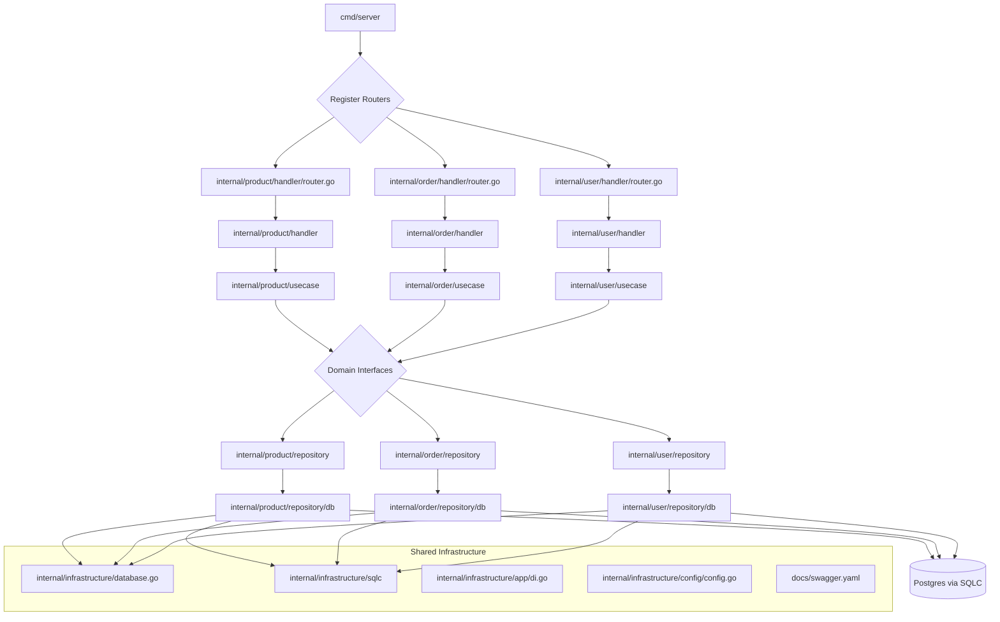

# Architecture

## System Architecture Overview
The E-commerce Backend Boilerplate follows a domain-driven Clean Architecture approach, decoupling business rules from framework and infrastructure concerns. The system comprises:
- REST API entrypoint (Fiber)
- Domain-specific HTTP handlers and routers (e.g., `internal/product/handler`)
- Domain-specific use case services encapsulating business logic (e.g., `internal/product/usecase`)
- Domain entities and interfaces defining business contracts (`internal/domain`)
- Domain-specific repository implementations managing data persistence (e.g., `internal/product/repository/db`)
- Shared infrastructure components (`internal/infrastructure`)
- Database migrations (`migrations`) and SQL query generation (SQLC)

## Layered Architecture
- **Presentation / API Layer**
  - **Location**: `cmd/server/main.go`, `internal/*/handler/router.go`
  - **Responsibilities**: Bootstraps Fiber app with dependency injection, registers domain-specific init modules, and invokes `SetupRoutes` in each handler. Init files include swagger annotations for API documentation.
- **Handler Layer**
  - **Location**: `internal/<domain>/handler`
  - **Responsibilities**: Validate request payloads, call use cases, format HTTP responses using JSend.
- **Use Case / Service Layer**
  - **Location**: `internal/<domain>/usecase`
  - **Responsibilities**: Encapsulate business rules and orchestrate repository calls.
- **Domain Layer**
  - **Location**: `internal/domain`
  - **Responsibilities**: Contain domain models (entities) and interfaces for repository and usecase boundaries.
- **Repository / Infrastructure Layer**
  - **Location**: `internal/<domain>/repository/db`, `internal/infrastructure/sqlc`
  - **Responsibilities**: Implement domain repository interfaces using SQLC-generated queries. **Handles all database transactions** to support query aggregation and ensure data consistency. Shared SQLC interfaces or entities are placed in `internal/infrastructure/sqlc`.
- **Shared Infrastructure**
  - **Location**: `internal/infrastructure`
  - **Responsibilities**: Database connections, configuration management (Viper), and other shared utilities.

## Component Relationships

## Data Flow
1. Client issues HTTP request to Fiber server.
2. Fiber router dispatches to the appropriate domain's router (`router.go`).
3. The domain handler validates input and converts it to a domain model.
4. Handler invokes a use case service method.
5. Use case orchestrates domain logic and calls the repository interface.
6. Repository implementation executes SQLC-generated queries against Postgres, managing transactions internally.
7. Results propagate back through the use case and handler to the HTTP response.

## Design Patterns & Key Decisions
- **Domain-Driven Clean Architecture**: For testable, modular, and scalable boundaries.
- **Dependency Inversion**: Handlers and use cases depend on interfaces, not concrete implementations.
- **SQLC for Type-Safe Queries**: SQLC generates Go code from SQL queries located in the `queries` directory at the project root. The generated code is centralized in `internal/infrastructure/sqlc` to provide a single data access layer.
- **Repository-Managed Transactions**: Repositories are responsible for handling database transactions to support atomic operations and query aggregation.
- **Enable SQLC emit_methods_with_db_argument**: Configure SQLC to pass the `*sql.DB` or `*sql.Tx` argument for multi-stage query support and transaction control within repositories.
- **Provide guidance on multi-stage queries**: Demonstrate structuring complex joins and transactions in domain repositories for efficient, maintainable data retrieval.
- **Guregu null types**: Use `github.com/guregu/null/v6` instead of generated `null` types for robust handling of nullable columns.
- **Domain-Specific Routing**: Each domain manages its own routes in a dedicated `router.go` file, includes swagger annotations for API documentation, and is registered in `cmd/server/main.go`.
- **Viper for Configuration**: Application configuration is loaded from YAML files (`configs/`), `.env` files, and environment variables.
- **Graceful Shutdown**: The application supports graceful shutdown to ensure all pending requests are handled before closing.
- **GoMock for Testing**: Use `go generate` to create mocks for interfaces.
- **UUID Strategy**: Use UUIDv7 for index-friendly primary keys to optimize database indexing.
- **gofiber/swagger**: Automatically generate and serve API documentation following OpenAPI specification.
- **Dependency Injection (samber/do)**: Use samber/do for application dependency injection to wire components.

## Critical Implementation Paths
- **Dependency Injection**: Using samber/do container to initialize and wire up dependencies in `cmd/server/main.go`.
- **SQLC Code Generation**: Queries in the `queries` directory generate Go types and methods into the centralized `internal/infrastructure/sqlc` directory.
- **Configuration Loading**: Viper loads configuration from multiple sources (`yaml`, `.env`, `env vars`) into a shared `config` struct.
- **Migrations**: Ensure the database schema aligns with SQLC queries and domain models.